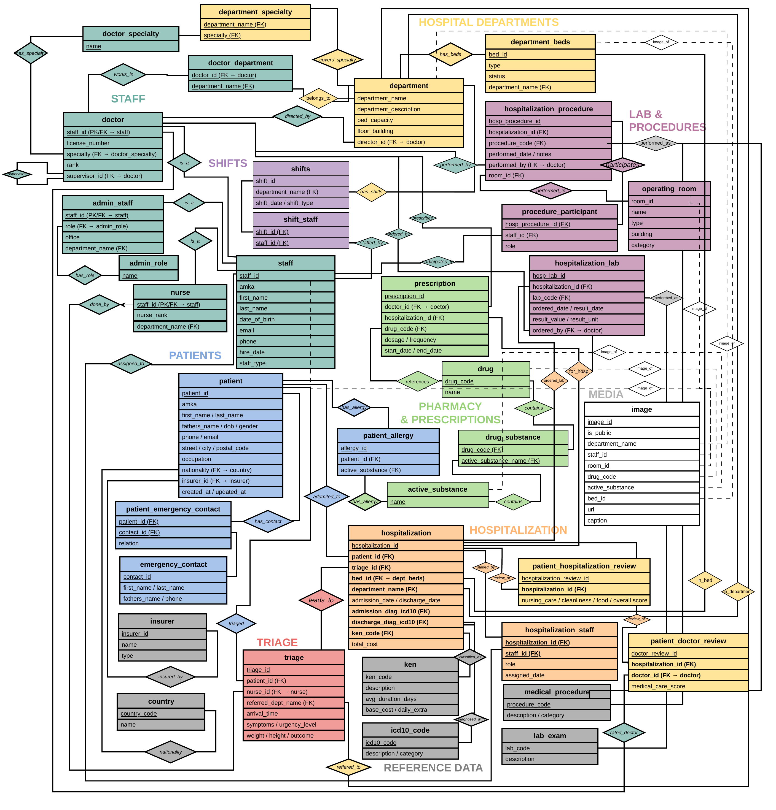

# Hospital Database E-R Diagram

Αυτό το README συνοψίζει το Entity-Relationship (E-R) διάγραμμα της βάσης δεδομένων ενός νοσοκομειακού πληροφοριακού συστήματος. Το διάγραμμα δείχνει τις βασικές οντότητες, τα primary/foreign keys και τις σχέσεις μεταξύ των πινάκων.

## E-R Diagram

## Σύντομη περιγραφή

Η βάση δεδομένων οργανώνεται σε βασικές θεματικές ενότητες:

### 1. Staff

Η οντότητα `staff` αποτελεί τη βασική οντότητα προσωπικού. Από αυτή προκύπτουν οι εξειδικευμένες οντότητες:

- `doctor`
- `nurse`
- `admin_staff`

Οι γιατροί συνδέονται με ειδικότητες, τμήματα, συνταγογραφήσεις, ιατρικές πράξεις και εργαστηριακές εξετάσεις.

### 2. Patients

Η οντότητα `patient` αποθηκεύει τα στοιχεία των ασθενών. Ένας ασθενής μπορεί να έχει εθνικότητα, ασφαλιστικό φορέα, επαφές έκτακτης ανάγκης, αλλεργίες, επισκέψεις triage, νοσηλείες, συνταγές και αξιολογήσεις.

### 3. Hospital Departments

Τα νοσοκομειακά τμήματα συνδέονται με γιατρούς, νοσηλευτές, διοικητικό προσωπικό, κλίνες και ειδικότητες. Κάθε τμήμα μπορεί να έχει διευθυντή και συγκεκριμένη χωρητικότητα κλινών.

### 4. Triage και Hospitalization

Το `triage` καταγράφει την άφιξη του ασθενή, τα συμπτώματα, το επίπεδο επείγοντος και το τμήμα παραπομπής. Η `hospitalization` συνδέει τον ασθενή με κλίνη, τμήμα, διαγνώσεις, προσωπικό, ιατρικές πράξεις, εργαστηριακές εξετάσεις και κόστος.

### 5. Pharmacy & Prescriptions

Η ενότητα φαρμακείου περιλαμβάνει φάρμακα, δραστικές ουσίες, σχέσεις φαρμάκου-ουσίας, αλλεργίες και συνταγογραφήσεις. Έτσι μπορεί να ελεγχθεί ποια δραστική ουσία περιέχεται σε κάθε φάρμακο και ποιες ουσίες προκαλούν αλλεργίες σε ασθενείς.

### 6. Lab & Procedures

Η ενότητα αυτή καλύπτει ιατρικές πράξεις, συμμετέχοντες σε πράξεις, χειρουργικές αίθουσες, εργαστηριακές εξετάσεις και αποτελέσματα εξετάσεων που σχετίζονται με νοσηλείες.

### 7. Shifts

Οι βάρδιες συνδέουν μέλη του προσωπικού με ημερομηνίες, τύπους βάρδιας και τμήματα, ώστε να παρακολουθείται το πρόγραμμα εργασίας.

### 8. Media

Η οντότητα `image` επιτρέπει τη σύνδεση εικόνων με τμήματα, προσωπικό, αίθουσες, φάρμακα, δραστικές ουσίες και κλίνες.

## Κύριες σχέσεις

- Ένας ασθενής μπορεί να έχει πολλές νοσηλείες.
- Μία νοσηλεία ανήκει σε τμήμα και μπορεί να συνδέεται με συγκεκριμένη κλίνη.
- Ένας γιατρός μπορεί να συνταγογραφεί φάρμακα.
- Ένα φάρμακο μπορεί να περιέχει μία ή περισσότερες δραστικές ουσίες.
- Ένας ασθενής μπορεί να έχει αλλεργία σε δραστικές ουσίες.
- Ένα τμήμα έχει κλίνες και καλύπτει ιατρικές ειδικότητες.
- Το προσωπικό συμμετέχει σε βάρδιες, νοσηλείες και ιατρικές πράξεις.
- Μία νοσηλεία μπορεί να περιλαμβάνει εργαστηριακές εξετάσεις και ιατρικές πράξεις.

## Σκοπός του διαγράμματος

Το E-R διάγραμμα προσφέρει μια συνολική εικόνα της δομής της βάσης δεδομένων. Χρησιμοποιείται για την κατανόηση των οντοτήτων, των σχέσεων, των κλειδιών και της λογικής οργάνωσης του συστήματος.
