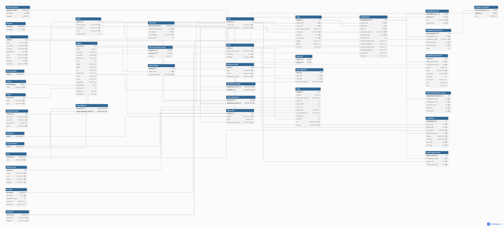

# Relational Model Documentation

Αυτό το README περιγράφει το **relational model** της βάσης του νοσοκομείου με βάση το `install.sql`.

## Relational Diagram

## Relational Schema - PK/FK/Cardinalities

- `country`: PK `country_code`
- `insurer`: PK `insurer_id`
- `department`: PK `department_name`; FK director_id -> doctor(staff_id) [0..1 parent, 0..1 children]
- `department_beds`: PK `bed_id`; FK department_name -> department(department_name) [1 parent, 0..N children]
- `doctor_specialty`: PK `name`
- `department_specialty`: PK `department_name, specialty`; FK department_name -> department(department_name) [1 parent, 0..N children]; specialty -> doctor_specialty(name) [1 parent, 0..N children]
- `doctor_department`: PK `doctor_id, department_name`; FK doctor_id -> doctor(staff_id) [1 parent, 0..N children]; department_name -> department(department_name) [1 parent, 0..N children]
- `staff`: PK `staff_id`
- `doctor`: PK `staff_id`; FK staff_id -> staff(staff_id) [1 parent, 0..1 children]; specialty -> doctor_specialty(name) [1 parent, 0..N children]; supervisor_id -> doctor(staff_id) [0..1 parent, 0..N children]
- `nurse`: PK `staff_id`; FK staff_id -> staff(staff_id) [1 parent, 0..1 children]; department_name -> department(department_name) [1 parent, 0..N children]
- `admin_role`: PK `name`
- `admin_staff`: PK `staff_id`; FK staff_id -> staff(staff_id) [1 parent, 0..1 children]; role -> admin_role(name) [1 parent, 0..N children]; department_name -> department(department_name) [1 parent, 0..N children]
- `active_substance`: PK `name`
- `drug`: PK `drug_code`
- `drug_substance`: PK `drug_code, active_substance_name`; FK drug_code -> drug(drug_code) [1 parent, 0..N children]; active_substance_name -> active_substance(name) [1 parent, 0..N children]
- `patient`: PK `patient_id`; FK nationality -> country(country_code) [0..1 parent, 0..N children]; insurer_id -> insurer(insurer_id) [0..1 parent, 0..N children]
- `emergency_contact`: PK `contact_id`
- `patient_emergency_contact`: PK `patient_id, contact_id`; FK patient_id -> patient(patient_id) [1 parent, 0..N children]; contact_id -> emergency_contact(contact_id) [1 parent, 0..N children]
- `patient_allergy`: PK `allergy_id`; FK patient_id -> patient(patient_id) [1 parent, 0..N children]; active_substance -> active_substance(name) [1 parent, 0..N children]
- `triage`: PK `triage_id`; FK patient_id -> patient(patient_id) [1 parent, 0..N children]; nurse_id -> nurse(staff_id) [1 parent, 0..N children]; referred_dept_name -> department(department_name) [0..1 parent, 0..N children]
- `ken_code`: PK `ken_code`
- `icd10_code`: PK `icd10_code`
- `medical_procedure`: PK `procedure_code`
- `lab_exam`: PK `lab_code`
- `hospitalization`: PK `hospitalization_id`; FK patient_id -> patient(patient_id) [1 parent, 0..N children]; triage_id -> triage(triage_id) [1 parent, 0..1 children]; bed_id, department_name -> department_beds(bed_id, department_name) [1 parent, 0..N children]; department_name -> department(department_name) [1 parent, 0..N children]; ken_code -> ken_code(ken_code) [0..1 parent, 0..N children]; admission_diag_icd10 -> icd10_code(icd10_code) [0..1 parent, 0..N children]; discharge_diag_icd10 -> icd10_code(icd10_code) [0..1 parent, 0..N children]
- `hospitalization_staff`: PK `hospitalization_id, staff_id`; FK hospitalization_id -> hospitalization(hospitalization_id) [1 parent, 0..N children]; staff_id -> staff(staff_id) [1 parent, 0..N children]
- `operating_room`: PK `room_id`
- `hospitalization_procedure`: PK `hosp_procedure_id`; FK hospitalization_id -> hospitalization(hospitalization_id) [1 parent, 0..N children]; procedure_code -> medical_procedure(procedure_code) [1 parent, 0..N children]; performed_by -> doctor(staff_id) [1 parent, 0..N children]
- `procedure_participant`: PK `hosp_procedure_id, staff_id`; FK hosp_procedure_id -> hospitalization_procedure(hosp_procedure_id) [1 parent, 0..N children]; staff_id -> staff(staff_id) [1 parent, 0..N children]
- `hospitalization_lab`: PK `hosp_lab_id`; FK hospitalization_id -> hospitalization(hospitalization_id) [1 parent, 0..N children]; lab_code -> lab_exam(lab_code) [1 parent, 0..N children]; ordered_by -> doctor(staff_id) [1 parent, 0..N children]
- `prescription`: PK `prescription_id`; FK doctor_id -> doctor(staff_id) [1 parent, 0..N children]; patient_id -> patient(patient_id) [1 parent, 0..N children]; drug_code -> drug(drug_code) [1 parent, 0..N children]; hospitalization_id -> hospitalization(hospitalization_id) [1 parent, 0..N children]
- `shifts`: PK `shift_id`; FK department_name -> department(department_name) [1 parent, 0..N children]
- `shift_staff`: PK `shift_id, staff_id`; FK shift_id -> shifts(shift_id) [1 parent, 0..N children]; staff_id -> staff(staff_id) [1 parent, 0..N children]
- `duty_assignment`: PK `duty_id`; FK staff_id -> staff(staff_id) [1 parent, 0..N children]; shift_id -> shifts(shift_id) [1 parent, 0..N children]; department_name -> department(department_name) [1 parent, 0..N children]
- `patient_hospitalization_review`: PK `hospitalization_review_id`; FK hospitalization_id -> hospitalization(hospitalization_id) [1 parent, 0..1 children]
- `patient_doctor_review`: PK `doctor_review_id`; FK hospitalization_id -> hospitalization(hospitalization_id) [1 parent, 0..N children]; doctor_id -> doctor(staff_id) [1 parent, 0..N children]
- `image`: PK `image_id`; FK department_name -> department(department_name) [0..1 parent, 0..N children]; staff_id -> staff(staff_id) [0..1 parent, 0..N children]; patient_id -> patient(patient_id) [0..1 parent, 0..N children]; room_id -> operating_room(room_id) [0..1 parent, 0..N children]; drug_code -> drug(drug_code) [0..1 parent, 0..N children]; active_substance -> active_substance(name) [0..1 parent, 0..N children]; allergy_id -> patient_allergy(allergy_id) [0..1 parent, 0..N children]; bed_id -> department_beds(bed_id) [0..1 parent, 0..N children]

## Cardinality Legend

- `1` = mandatory exactly one parent row.
- `0..1` = optional parent row or unique child reference.
- `0..N` = zero or many child rows.
- `PK/FK` = το column είναι ταυτόχρονα primary key και foreign key, συνήθως για subtype ή junction table.
- `composite FK` = foreign key που αποτελείται από περισσότερα από ένα columns.
